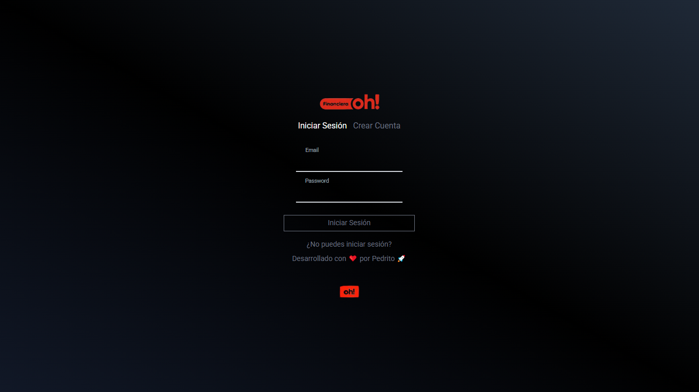
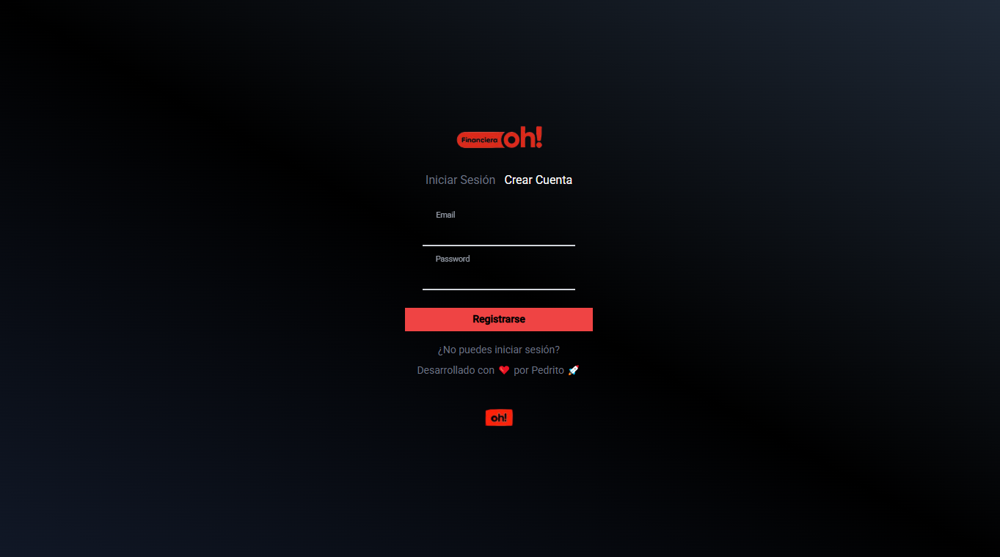
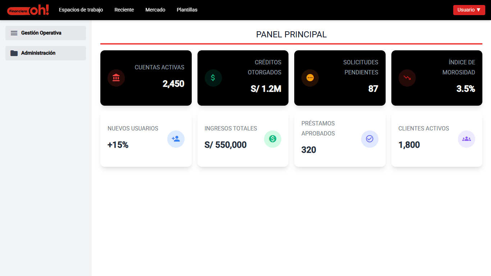

# Reto Financiera Oh

## 📊 Descripción

**Reto Financiera Oh** es una aplicación desarrollada como **prueba técnica** para evaluar habilidades avanzadas en desarrollo frontend con **Angular**.

➡️ Como parte del proceso, se realizó la **migración completa del proyecto desde Angular 13 a Angular 16**, cumpliendo con los lineamientos solicitados en la evaluación.

El proyecto simula un **dashboard financiero profesional**, inspirado en Trello, con un enfoque en:

- Buenas prácticas de **arquitectura Angular**.
- **UI/UX moderno y responsivo** usando Tailwind.
- Manejo de **autenticación local encriptada**.
- Componentes reutilizables y accesibles.

## 🛠️ Tecnologías utilizadas

- ⚙️ **Angular 16.x (Migrado desde v13)** ✅
- 🎨 **Tailwind CSS 2.x** (utilizado para diseño moderno y responsive)
- 🧩 **Angular Material Icons** (para iconografía profesional)
- 🔐 **CryptoJS** (encriptación local AES para login/register)
- 🔔 **MatSnackBar** (feedback visual, actualizado sin legacy)
- 📦 **LocalStorage Simulation** (persistencia de usuarios en frontend)
- 🖥️ **Responsive Design con Flexbox & Tailwind**

## 🚀 Funcionalidades principales

| Función | Descripción |
|---------|-------------|
| 🔑 **Login & Registro** | Validaciones con encriptación AES, gestión de múltiples usuarios locales |
| 🏠 **Home Dashboard** | Vista tipo Trello con navbar fijo, sidebar responsivo y estadísticas |
| 🎨 **UI/UX Profesional** | Adaptación a escritorio y móvil con Tailwind CSS |
| ⚙️ **Menús desplegables** | Lógica para dropdowns personalizados con cierre al hacer clic fuera |
| 🔔 **Notificaciones visuales** | Implementadas con MatSnackBar (Angular 16 actualizado) |

## 📝 Notas técnicas de migración
- ✔️ Migración gradual de Angular CLI, Core y CDK hasta versión **16.x**.
- ✔️ Reemplazo de **MatLegacySnackBar ➔ MatSnackBar** actualizado.
- ✔️ Refactor de dependencias obsoletas (ngx-toastr removido).
- ✔️ Configuración de styles y build optimizado para Angular 16.
- ✔️ Uso de **Tailwind** como base de diseño responsive.

## Vistas Previas

A continuación, se muestran capturas de pantalla de las secciones principales del proyecto:

### 1. Pantalla de Login

> **Descripción:** Esta es la interfaz de inicio de sesión donde los usuarios pueden ingresar sus credenciales para acceder a la aplicación financiera. Presenta campos claros para el nombre de usuario y la contraseña, junto con un botón de acceso.

#### 2. Pantalla de Registro

> **Descripción:** La pantalla de registro permite a los nuevos usuarios crear una cuenta en la plataforma. Incluye campos para la información personal necesaria y un botón para completar el registro.

#### 3. Página de Inicio (Dashboard)

> **Descripción:** Esta es la página principal del dashboard, donde los usuarios obtienen una visión general de sus métricas financieras clave y acceden a las diferentes funcionalidades de la aplicación.

## Development server

Run `ng serve` for a dev server. Navigate to `http://localhost:4200/`. The app will automatically reload if you change any of the source files.

## Code scaffolding

Run `ng generate component component-name` to generate a new component. You can also use `ng generate directive|pipe|service|class|guard|interface|enum|module`.

## Build

Run `ng build` to build the project. The build artifacts will be stored in the `dist/` directory.

## Running unit tests

Run `ng test` to execute the unit tests via [Karma](https://karma-runner.github.io).

## Running end-to-end tests

Run `ng e2e` to execute the end-to-end tests via a platform of your choice. To use this command, you need to first add a package that implements end-to-end testing capabilities.

## Further help

To get more help on the Angular CLI use `ng help` or go check out the [Angular CLI Overview and Command Reference](https://angular.io/cli) page.
